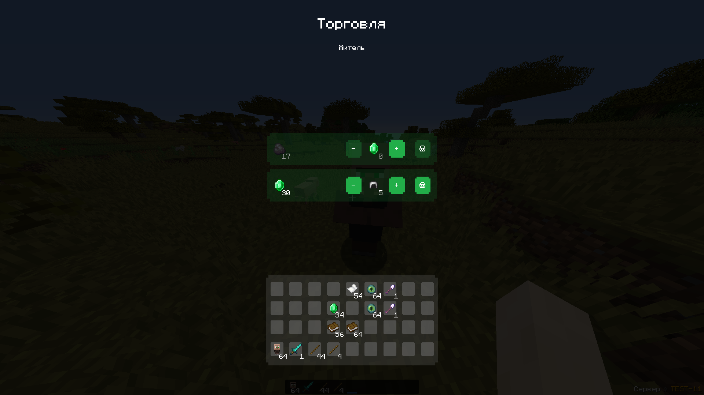

# TradeAPI



### Создание набора трейдов
```java
TradeSelection selection = TradeService.getInstance()
                .builder() // Дефолтный билдер набора трейдов
                .setTitle(String)
                .setSubTitle(String)
                .appendCloseHandler(TradeCloseHandler)
                .appendOpenHandler(TradeOpenHandler)
                .setTradeBuyHandler(TradeBuyHandler)
                .registerNewTrade(new Trade(price, null, itemStack, TradeState.BASIC))
                .buildFor(Player);
```

### TradeSelection
```java 
selection.openSelection() -> отправка набора игроку, для которого был он создан
selection.closeSelection()
selection.reopen()

selection.getTrades() -> Получение коллекции всех трейдов в этом наборе

selection.isClosed()

selection.handleClientClosing() -> Вызов обработки закрытия/открытия меню без самого закрытия/открытия этого меню
selection.handleClientOpening()

selection.updateTradeInventory() -> Насильное обновление инвентаря клиента. По дефолту обновляется каждый раз после покупки предмета
```

> Если состав готового набора трейдов изменился, то для обновления необходимо отправить набор клиенту повтороно. (TradeSelection#reopen())

### TradeService
```java
TradeService#find(UUID) -> Достать открытый набор трейдов игрока
TradeService#findAll() -> Достать список со всеми существующими открытыми наборами
```
